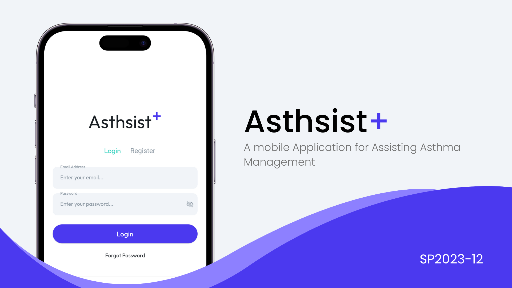

# Asthsist+



## Build status
| Platform | Status |
|----------|--------|
|Android|:heavy_check_mark:|
|iOS|:x:|

## About
Asthsist+ is a mobile application for assisting asthma management, enabling patients to self-monitor and manage their asthma symptoms effectively on a daily basis. This comprehensive solution aims to equip patients with the tools needed to manage their asthma and enhance their quality of life. 

 This project is a part of the senior project submitted in partial fullfillment of the Requirement for THE DEGREE OF BACHELOR OF SCIENCE (INFORMATION AND COMMUNICATION TECHNOLOGY) Faculty of Information and Communication Technology, Mahidol University 2023

### Features :stethoscope:
- :cloud: Environmental trigger monitoring 
- :pill: Asthma activity and medication tracking 
- :watch: Integration with wearable devices via Google Fit 
- :memo: Asthma control test 
- :gear: Peak flow zone prediction using machine learning 

### Application

This application is built using Flutter, a UI toolkit from Google that allows the creation of natively compiled applications for mobile, web, and desktop from a single codebase. The application uses Firebase for backend services like authentication, database, and storage.

### Machine Learning

The machine learning part of this project is implemented using Python in a Google Colab notebook. Google Colab is a cloud-based Python development environment that provides GPU acceleration for free.


The trained model is then exported and integrated into the Flutter application for inference.

Please refer to the 'Running the project' section for instructions on how to set up and run the Flutter application and the Google Colab notebook.


## Running the project
### Requirements :syringe:

#### For the Flutter Project :iphone:

To run this Flutter project, you will need the following:

1. **Flutter SDK**: Make sure you have Flutter installed on your machine. To check if it's installed and set up correctly, run `flutter doctor` in your terminal/command prompt. If Flutter is not installed, you can download it from the Flutter website.

2. **Dart SDK**: Dart is the programming language used in Flutter. The Dart SDK is bundled with Flutter; it is not necessary to install Dart separately.

3. **Android Studio/IntelliJ/VsCode**: These are the recommended IDEs for Flutter development. They have plugins for Flutter and Dart which make development easier. You can download them from their respective websites.

4. **A device/emulator**: You will need a device running Android or iOS for app testing. If you don't have a device, you can use an emulator on your development machine.

5. **Firebase**: This project uses Firebase. Make sure you have set up a Firebase project and added the configuration files to your project. Follow the instructions in the Firebase documentation to set this up.

6. **Git**: Git is a version control system that helps manage and track changes to your code. If you're downloading this project from GitHub, you'll need Git installed on your machine.

#### For the Google Colab Python Notebook :notebook:

To run the Python notebook in Google Colab, you will need the following:

1. **Google Account**: You will need a Google account to access Google Colab.

2. **Python**: Basic knowledge of Python is required to understand and run the notebook.
   

Please ensure that you have all these requirements met before trying to run this Flutter project and the Google Colab Python notebook.

### Running Flutter project

Follow these steps to get the project up and running on your local machine:

1. **Clone the Repository**: First, clone the repository to your local machine. You can do this by running the following command in your terminal:

```bash
git clone https://github.com/MeenVP/AsthsistPlus.git
```

2. **Navigate to the Project Directory**: Use the `cd` command to navigate to the directory of the project:

```bash
cd AsthsistPlus
```

3. **Get Flutter Packages**: Run the following command in your terminal to get all the required Flutter packages:

```bash
flutter pub get
```

4. **Run the Project**: Finally, you can run the AsthsistPlus project on your emulator or physical device using the following command:

```bash
flutter run
```
Please note that you need to have an emulator running or a physical device connected to your machine to run the project.

### Running Google Colab Python Notebook

1. **Download the Dataset**: Click on the `Clean_data_2.csv` file in the `ml` folder in the GitHub repository, then click on 'Download'. This will download the dataset to your local machine.

2. **Upload the Dataset to Google Drive**: Go to your Google Drive, click on 'New' -> 'File upload', then select the downloaded `Clean_data_2.csv` file to upload it to your Google Drive.
   
3. **Open the Notebook**: Click on the link to the `.ipynb` file in the GitHub repository. This will open the notebook in GitHub.

4. **Open in Colab**: Click on the 'Open in Colab' button at the top of the notebook. This will open the notebook in Google Colab.

5. **Mount Google Drive in Google Colab**: In your Google Colab notebook, you can mount your Google Drive by running the following code in a cell:

```python
from google.colab import drive
drive.mount('/content/drive')
```
6. **Access the Dataset**: Now you can access the dataset file in your Google Drive from your Google Colab notebook. If you uploaded the dataset to the root of your Google Drive, you can access it like this:

```python
dataset = pd.read_csv('/content/drive/MyDrive/Clean_data_2.csv')
```

Remember to always keep your dataset file updated in your Google Drive if there are changes in the GitHub repository.
